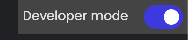
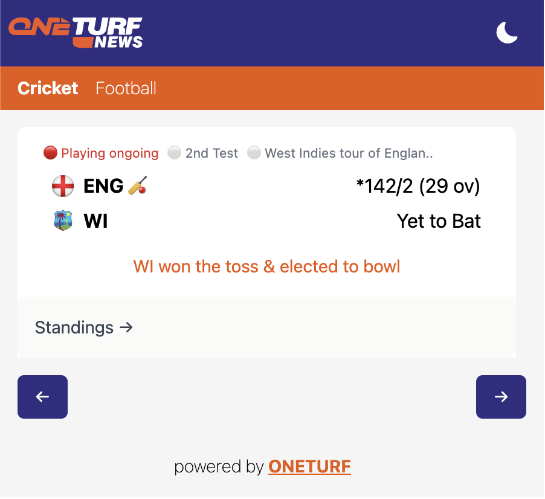
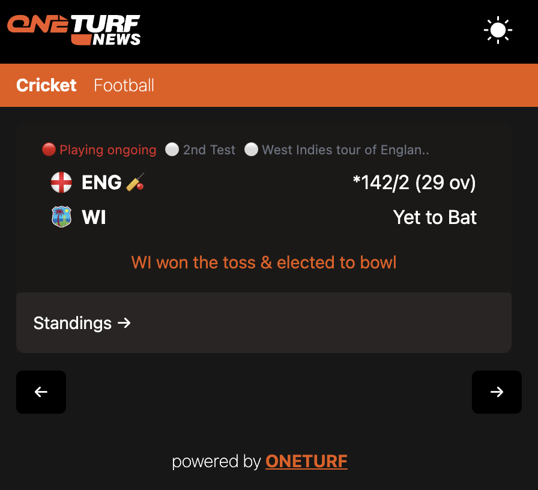

# Flow

- The chrome extension is a React + TypeScript codebase
- The `public` folder contains a `manifest.json` file which provides metadata about the extension, such as its name, version, and permissions
- When running `npm run build`, a `dist` folder is generated, which will also include the compiled `manifest.json` file

# Installation

- Go to any browser of choice and on the top right, click on the Extensions logo: 
- Further in the menu, at the bottom, click `Manage Extensions`
- Enable Developer Mode: 
- Click **Load unpacked** on the top left, go to the codebase folder, and choose the `dist` folder.
- A successful addition will display `Extension Loaded`
- This adds the extension to your browser
- Reference Resources: [YouTube Tutorial](https://youtu.be/gtF2nHVjqFk?feature=shared&t=121)

# Bookmarking

- After installation, click on the Extensions logo: 
, you will see `One Turf Cricket`. Click the pin logo beside it to bookmark it to your browser
- Simply click on the extension to see it live

# View

- Light Mode: 

- Dark Mode:

# Implementation Documentation

- [Technical Documentation](https://docs.google.com/document/d/1mNihqPlbcD_SWOhXUYSXFok4iNyHpVQuben8BiV0oao/edit?usp=sharing)